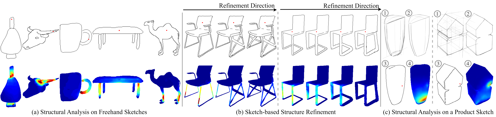

# Sketch2Stress: Sketching with Structural Stress Awareness



> [Deng Yu](https://dengyuhk.github.io/), Chufeng Xiao, [Manfred Lau](https://www.scm.cityu.edu.hk/people/lau-chung-man-manfred), [Hongbo Fu](https://sweb.cityu.edu.hk/hongbofu/)
>
> [[Paper]](https://arxiv.org/abs/2306.05911) [[Project Page]](https://dengyuhk.github.io/Sketch2Stress/) [[Dataset]](#Dataset) [[Video]](https://www.youtube.com/watch?v=WLfEeeFJbYY)
>
> Accepted by IEEE TVCG 2023

## Prerequisites

Python version:

**python 3.6.9**

Clone this repository and install the dependent libraries (virtual environment recommended):

```bash
git clone https://github.com/dengyuhk/Sketch2Stress.git
cd Sketch2Stress

pip install virtualenv
virtualenv sk2stress_venv -p /usr/bin/python3.6

source sk2stress_venv/bin/activate
pip install -r requirements.txt 
```

## Getting Started

### Pretrained Models

Please download our [pretrained models](https://drive.google.com/file/d/1h4YdpRQ1H_ohvCtCxWxgV-x0siH01VfR/view?usp=sharing) and put them into the `checkpoints` folder.

### Dataset

You can download our created [dataset](https://drive.google.com/file/d/1EdItIZgZRyj8uHh1gWykjtBQZYTcrK6-/view?usp=sharing) and put them into the `dataset` folder for further training and testing. If you download and use the dataset, you agree to the below items:

* The dataset is available for non-commercial research purposes only.
* You agree not to reproduce, duplicate, copy, sell, trade, resell or exploit for any commercial purposes, any portion of the images and any portion of derived data.
* We reserves the right to terminate your access to *Sketch2Stress* dataset at any time.

> Note: Due to limited storage of my Google Drive, the `dataset` only contains one category, **guitar**, but is sufficient for training and testing.  

### Network Training and Testing

You can train and test our network using the scripts:

```bash
# You can run one line of the below commands for a certain purpose

## For traning (The checkpoint and resulting files during training will be saved in the 'checkpoints' folder):
sh train_script.sh

## For testing (The results will be saved in the 'results' folder):
sh test_script.sh
```

## Acknowledgments

This code is developed based on [pix2pix](https://github.com/phillipi/pix2pix).

## BibTeX

```tex
@article{yu2023sketch2stress,
  title={Sketch2Stress: Sketching with Structural Stress Awareness},
  author={Yu, Deng and Xiao, Chufeng and Lau, Manfred and Fu, Hongbo},
  journal={arXiv preprint arXiv:2306.05911},
  year={2023}
}
```

