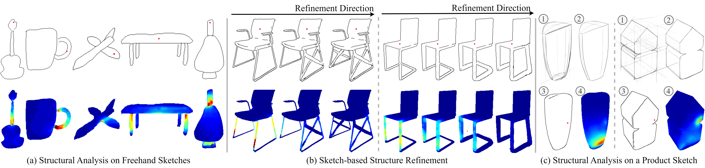
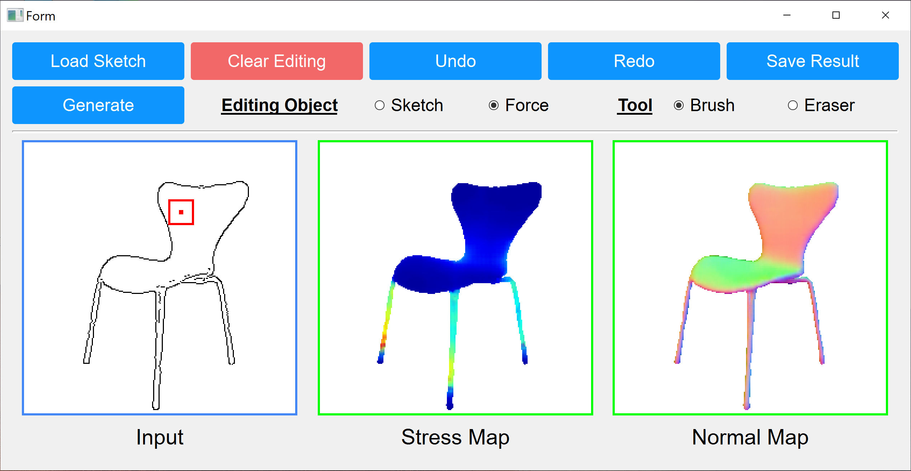
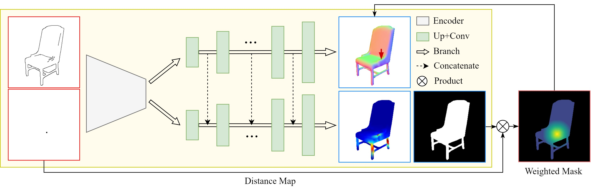
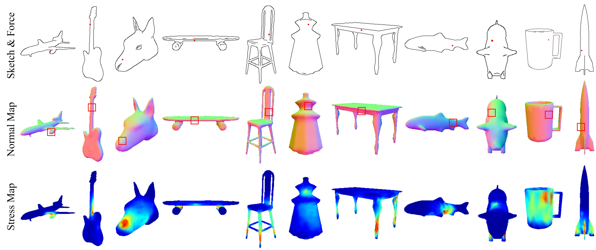

# *Sketch2Stress:*  Sketching with Structural Stress Awareness 
###### [Deng Yu](https://scholar.google.com/citations?user=Yi4KFWwAAAAJ&hl=en)&nbsp;&nbsp; [Chufeng Xiao](https://scholar.google.com/citations?user=2HLwZGYAAAAJ&hl=en&oi=ao) &nbsp;&nbsp; [Manfred Lau](https://www.scm.cityu.edu.hk/people/lau-chung-man-manfred)$^{*}$ &nbsp;&nbsp;  [Hongbo Fu](https://sweb.cityu.edu.hk/hongbofu/)$^{*}$ 

######  School of Creative Media, City University of Hong Kong

###### * Corresponding author

###### Accepted by [IEEE TVCG](https://www.computer.org/csdl/journal/tg)

###### [[Paper & Supplemental Material]](https://arxiv.org/abs/2306.05911) &nbsp;&nbsp;&nbsp;&nbsp; [[Dataset & Code]]()(coming soon)



**Fig. 1 **: Our *Sketch2Stress* system supports users to easily perform structural analysis on their freely sketched objects by assigning forces at desired locations (shown in red dots) (a) and structural refinement (in each example, the upper row shows the progressively refined sketches while the bottom row shows our computed stress maps) on the weak regions of problematic sketched objects with real-time feedback of a stress map
along with their editing operations (b). We also show that our system can handle professional product sketches, e.g., those in the OpenSketch dataset (c). In (c), we illustrate two examples of using professional product sketches for structural analysis, starting from the concept sketches, then the presentation sketches, the clean sketches, and finally, our generated structural stress maps.

## Abstract

In the process of product design and digital fabrication, structural analysis of a designed prototype is a fundamental and essential step. However, such a step is usually invisible or inaccessible to designers at the early sketching phase. This limits the users’ ability to contemplate a shape’s physical properties and structural soundness. To bridge this gap, we introduce a novel approach *Sketch2Stress* that allows users to perform structural analysis of desired objects at the sketching stage, as displayed in Figure 1. This method takes as input a sketch and a point map to specify the location of a user-assigned external force. It automatically predicts a normal map and a corresponding structural stress map distributed over the user-sketched underlying object. In this way, our method empowers designers to easily examine the stress sustained everywhere and identify potential problematic regions over their sketched object. Furthermore, combined with the predicted normal map, users are able to conduct a region-wise structural analysis efficiently by aggregating the stress effects of multiple forces in the same direction. We demonstrate the effectiveness and practicality of our system with extensive experiments and two user studies.

## Interface 



​                                                                     **Fig 2**: Our Sketching Interface.


## Pipeline



**Fig 3**:  Overview of the multi-branch generator of *Sketch2Stress*. Given an input sketch (upper left) and an input point map (lower left) indicating a force location, the multi-branch generator uses its encoder to learn a sketch-force joint feature space, and then leverages two decoders to synthesize the corresponding stress map (lower branch) and a normal map (upper branch). We use warmer colors (reds and yellows) to show high stress and cooler colors (greens and blues) to show low stress. The normal map infers the force direction at the input force location. A shape mask and a point-attention mask are proposed to further emphasize the shape boundaries and force locations during the generation process.

## Sketch-based Structure Analysis



**Fig 4**:  Result gallery of eleven categories in our synthetic sketch-to-stress dataset. The top row shows the input sketches and external force locations (plotted as red dots), while the middle and bottom rows are our generated normal maps (with predicted force directions at the center of red boxes) and synthesized stress maps. 

## Structure Refinement without/with our *Sketch2Stress*


**Fig 5**: Each triplet contains a structurally problematic sketch under different force configurations (red dots on sketches), and the user-refined results without and with our tool, respectively. The corresponding stress maps are provided under the refined sketches.

## Structural Analysis on Real Product Sketches


**Fig 6**: Our *Sketch2Stress* method applied to the OpenSketch dataset. The concept and presentation sketches of the bump, shampoo bottle, and potato chip (in the first, second, and third rows) are from ”Professional1” while the bottom two rows of the tube and the house are from ”Professional5” and ”Professional6” in the OpenSketch dataset. Please zoom in to examine the details.


## Citation 

```tex
@article{yu2023sketch2stress,
  title={Sketch2Stress: Sketching with Structural Stress Awareness},
  author={Yu, Deng and Xiao, Chufeng and Lau, Manfred and Fu, Hongbo},
  journal={arXiv preprint arXiv:2306.05911},
  year={2023}
}
```


